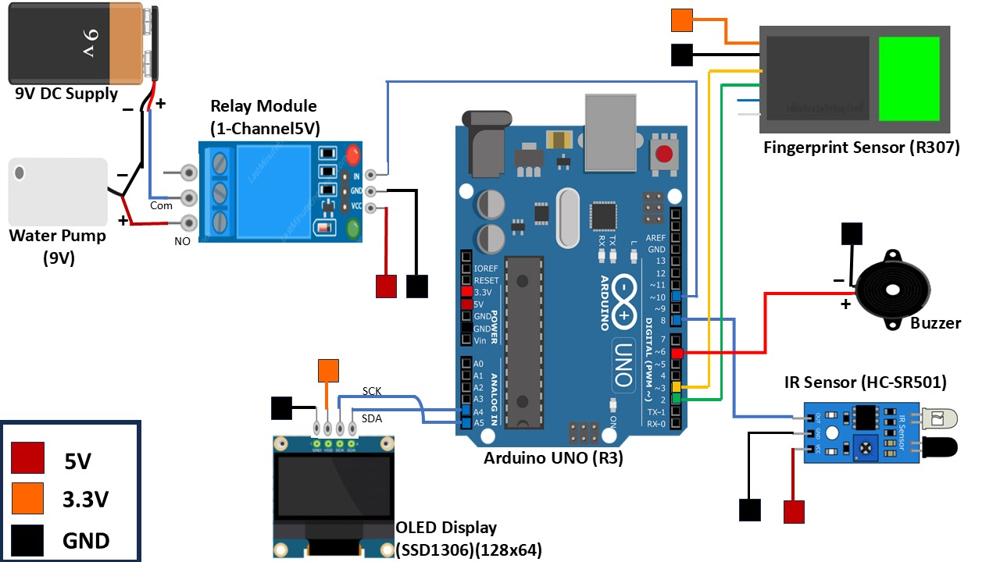

#**Handwash Monitoring System**
Developed an IoT-based automatic handwash monitoring system using Arduino Uno to ensure proper hand hygiene. The system integrates an **IR sensor (HC-SR501)** to detect hand presence, a **fingerprint sensor (R307)** for user authentication, an **OLED display (SSD1306, 128x64)** for real-time guidance, and a **relay-controlled water pump** for automated water dispensing. A **buzzer** provides audio alerts for user compliance. This project enhances hygiene awareness and ensures a structured handwashing process.

**Technologies Used**: Arduino, IoT Sensors, OLED Display, Relay Module, Embedded C

**Circuit Diagram**:

